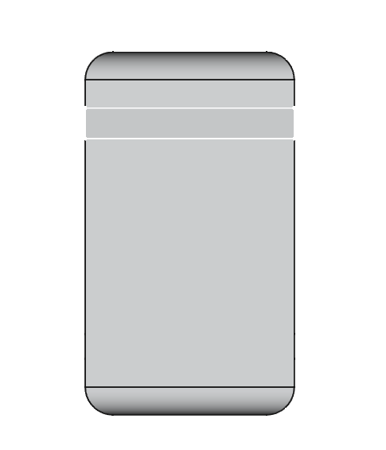
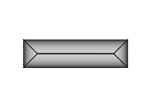
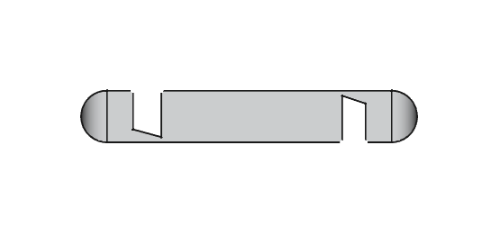
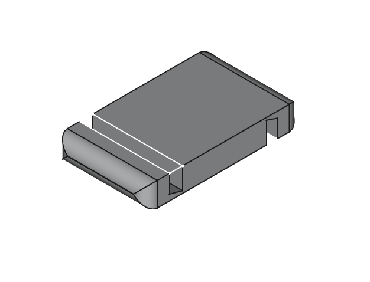

# Proyecto de Diseño 3D en FreeCAD

Este proyecto consiste en el diseño de un modelo 3D representado en diferentes vistas: alzado, planta, perfil e inclinado. A continuación, se muestran las vistas correspondientes del modelo, junto con un enlace a una demostración en video.

## Vistas del modelo:

### Vista en Planta:

  

### Vista en Alzada:

  

### Vista en Perfil:

  

### Vista Inclinada:

  

## Video de Demostración:

Puedes ver una demostración del diseño en el siguiente video:

[Beerge en FreeCad](https://studio.youtube.com/video/HW9BRD8jYlw/edit)
